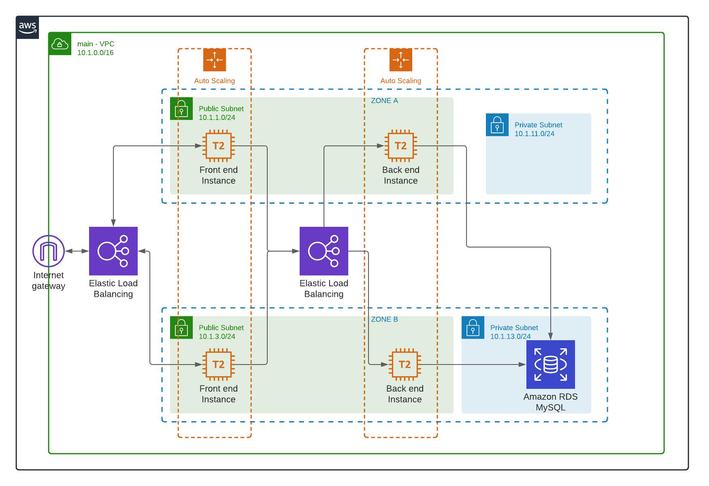

# Infra-Terraform-AWS-example

Ce repertoire montre un example de comment monter cette architecture multicouche rapidement afin de suivre un guide spécifique de migration dans Amazon Web Services (AWS)

## **website architecture (on-demand)**

# Requis
* Un compte de [AWS](https://aws.amazon.com/free/)
* Avoir [Terraform installé](https://www.terraform.io/downloads.html)

